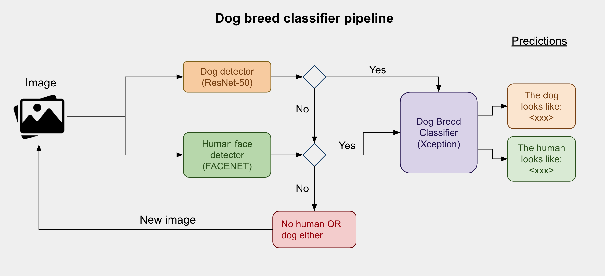
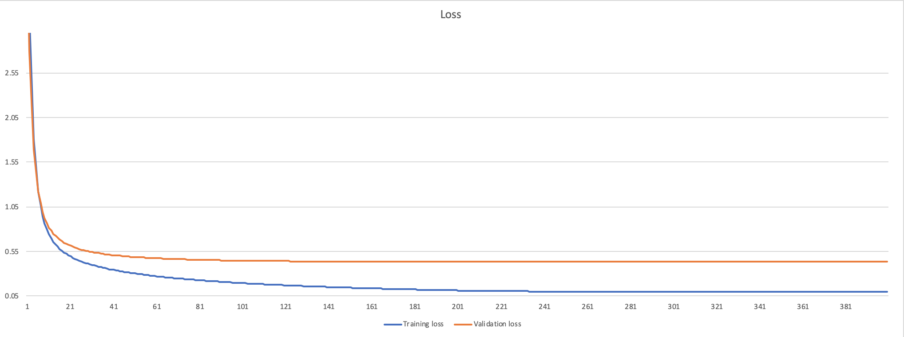
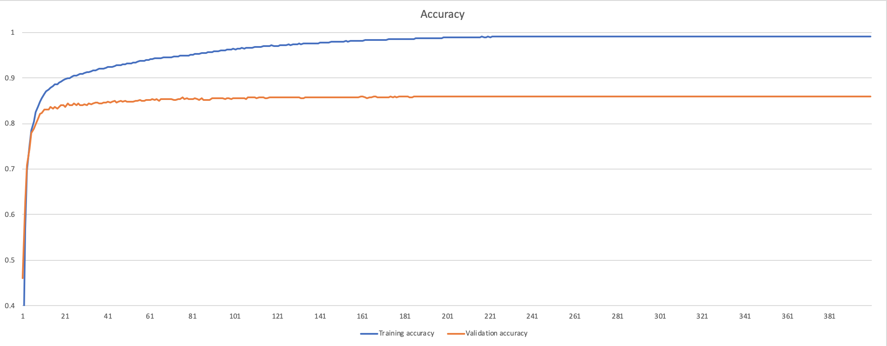
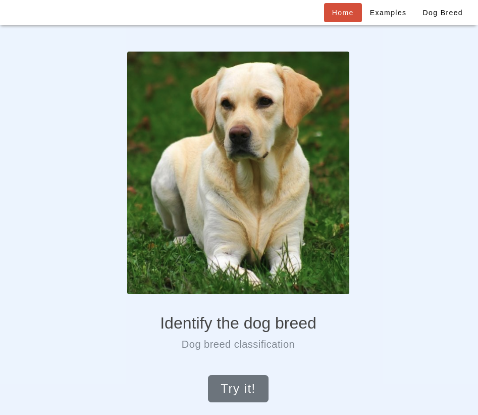
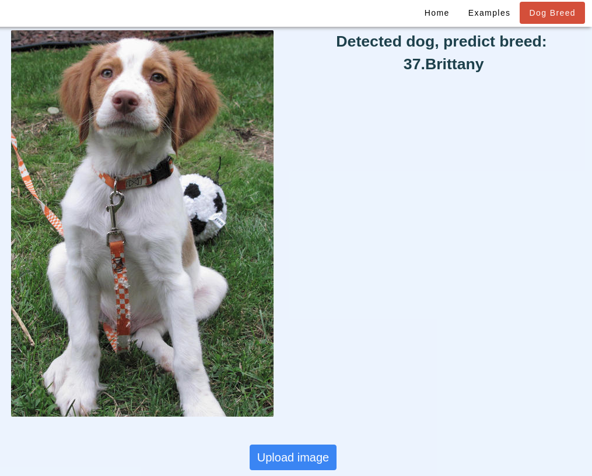
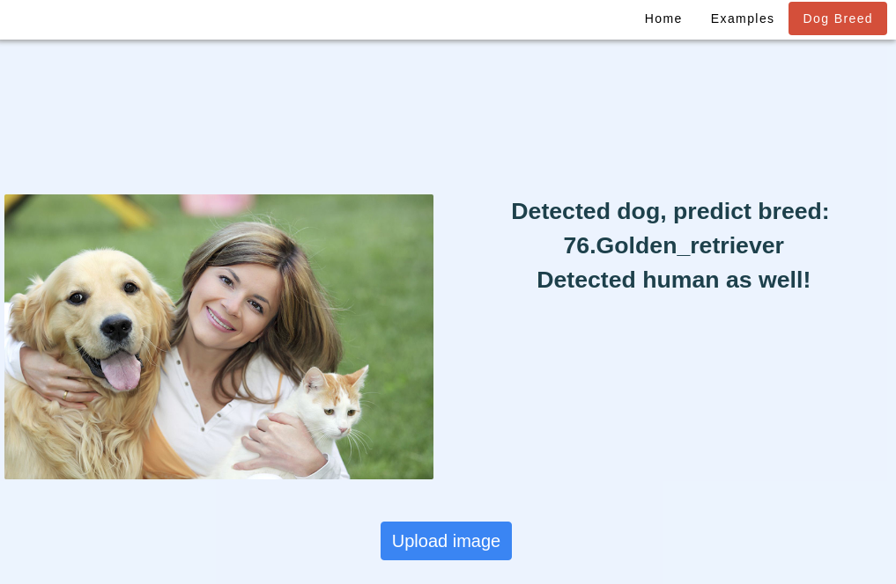

# Dog Breed Classifier
This project is part of Udacity's Data Scientist Nanodegree. The problem which will be solved in this project is to identify the breed of dogs using convolutional neural network. The goal is that builds a pipeline that takes an image as input and detects whether or not the image contains human or dog, then predicts the breed of the dog or the human resembles dog breed.

# Overview

The pipeline includes three models: 
- Dog detector: A binary classifier. Uses a ResNet-50 pre-trained on ImageNet. Since the model output 1000 classes, as long as the output falls into one of the dog categories, the model will output `TRUE`
- Human face detector: A binary classifier. Uses a pre-trained `FACENET` to detect the human face.

The image will be passed into `Dog Breed Classifier` when either `Dog detector` or `Human face dectector` output `True`, otherwise will request input a new image to start over. 

## Approach
As a baseline, I created a very simple VGG-like network which reach `9.93%` on test set when trained for 20 epoches from the scratch:
- Took the first 2 blocks of VGG16 and appened a Batch Normalization layer to each block which I think it can accelerate the training along with larger learning rate.
- Added another extra conv block (256) just because the number of class is 133 while the number of neurons is 128 after 2 blocks. 
- Followed by a global average pooling against the overfitting and more robust for inputs.
```python
# A tiny VGG-like network as the baseline
num_classes = 133
input_tensor = Input(shape=(224, 224, 3))
# block 1
x = Conv2D(64, kernel_size=(7, 7), padding="valid", activation="relu")(input_tensor)
x = Conv2D(64, kernel_size=(3, 3), padding="valid")(x)
x = BatchNormalization()(x)
x = Activation("relu")(x)
x = MaxPooling2D(pool_size=(2, 2), strides=2)(x)
# block 2
x = Conv2D(128, kernel_size=(3, 3), padding="valid", activation="relu")(x)
x = Conv2D(128, kernel_size=(3, 3), padding="valid")(x)
x = BatchNormalization()(x)
x = Activation("relu")(x)
x = MaxPooling2D(pool_size=(2, 2), strides=2)(x)
# extra block
x = Conv2D(256, kernel_size=(3, 3), padding="valid", activation="relu")(x)
x = MaxPooling2D(pool_size=(2, 2), strides=2)(x)

x = GlobalAveragePooling2D()(x)
x = Dense(num_classes, activation="softmax")(x)
```

Since training from scratch will take long time and large dataset to achive the good performance, I then turned to use `Transfer Learning` leverage the imagenet pre-trained weights. The Keras-Application provides several pre-trained networks such as: VGG-19, ResNet-50, InceptionV3 and Xception. I prefer `Xception` because it introduces group convolution and residual connection as improvements for InceptionV3, and VGG-19 is very slow compare to others.

```python
classifier = Sequential()
classifier.add(GlobalAveragePooling2D(input_shape=(7, 7, 2048)))
classifier.add(Dense(133, activation='softmax'))
classifier.summary()
_________________________________________________________________
Layer (type)                 Output Shape              Param #   
=================================================================
global_average_pooling2d_2 ( (None, 2048)              0         
_________________________________________________________________
dense_2 (Dense)              (None, 133)               272517    
=================================================================
Total params: 272,517
Trainable params: 272,517
Non-trainable params: 0
_________________________________________________________________
```

Xception is actually a backbone in the `Dog Breed Classifier` for image feature extractor, for example:
```python
# extract image features through backbone
backbone = xception.Xception(weights='imagenet', include_top=False)
img_features = backbone.predict(xception.preprocess_input(img))
# obtain predicted vector
pred = classifier.predict(img_features)
```

### metrics
```Accuracy = (TP + TN) / (TP + TN + FP + FN)```

### training
Since only re-train the last layer, I used a relative small learning rate (`5e-3`) and trained with SGD optimizer for 400 epoches. The training finally achieved: 
```bash
# training
loss: 0.1026
accuracy: 0.9904
# validation
val loss: 0.4330
val accuracy: 0.8587
```
#### Loss curve:

#### Accuracy curve:


## Requirements
- Python 3.6
- Keras + Tensorflow
- Flask

### installation
```bash
pip install -r requirements.txt
```

## Web application
A web application been provided for running the inference on the dog breed classification.

### Through docker

- Build docker image
```
docker build -t dog-breed .
```
- Run the container
```
docker run -it -p 3001:3001 dog-breed
```
### Directly run with Python
```bash
cd webapp
python3 run_server.py
```
Access the web app through the URL: `http://<ip>:3001`

## Results and conclusion
Tried VGG-16, ResNet-50 and Xception pre-trained models from Keras application, the best result showed with Xception pre-trained model which achieved `85.77%` accuracy on the test set. 

| Network | Pre-trained | Accuracy |
| ------- | ----------- | -------- |
| Baseline | No | 9.93% |
| VGG-16 | Yes (ImageNet) | 45.70%  |
| ResNet-50 | Yes (ImageNet) | 80% |
| **Xception** | Yes (ImageNet) | **85.77%** |

The pros and cons of each networks:
- The VGG-16 network is pretty large DNN which result in slow inference speed thought it is a very straightforward architecture.
- The ResNet-50 performs better than VGG-16 not only in fast inference (ResNet50 - `25 millions` weights vs. VGG16 - `138 millions` weights ), but also has lower top-1 error on ILSVRC dataset (ResNet50 - `20.74` vs. VGG16 - `24.4`)
- The Xception is the succesor of InceptionV3 which replaces the standard Inception modules with depthwise separable convolutions and introduces the residuals. With even less number of weights, produces higher top-1 accuracy on ImageNet than InceptionV3 (Xception - `0.790` vs. InceptionV3 - `0.782`)

If we look at their performance on ImageNet, it also make sense Xception is the best among these networks.

| Network | # weights (million) | Top-1 accuracy | Top-5 accuracy |
| ------- | ------------------- | -------------- | -------------- |
| VGG-16 | 138 | 0.715 | 0.901 |
| ResNet-50 | 25.6 | 0.749 | 0.921 |
| InceptionV3 | 23.8 | 0.782 | 0.941 |
| **Xception** | **22.9** | **0.790** | **0.945** |


## Discussion
Appearently, there are several ways can push the accuracy further more:
- Improve the accuracy of dog breed > 90% by either use data augmentation or more sophisticated pre-trained model like ResNeXt
- Use Ensemble approach that average the outputs from multiple individual DNN to increase the accuracy.
- The current pipeline uses three DNNs (human detector, dog detector and dog breed classifier) which result in slow inference speed. If possible, train an end-to-end network would be better for inference speed.

## Screenshots


